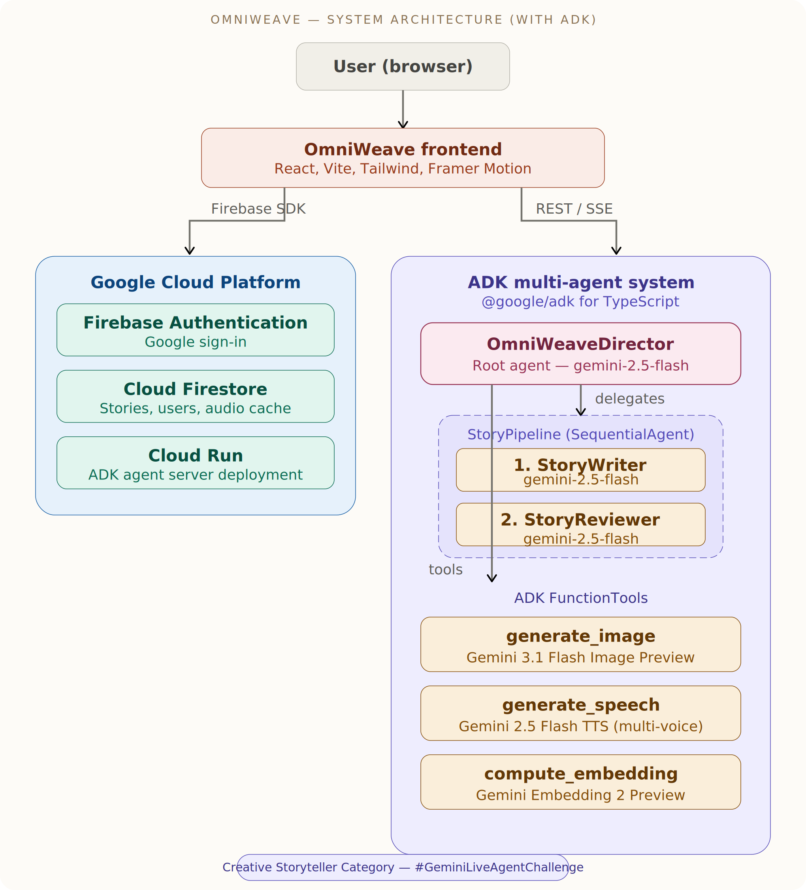

<div align="center">

# 🧵 OmniWeave

**A multimodal creative director that weaves text, AI-generated images, and multi-voice narration into cinematic stories.**

*Built for the Gemini Live Agent Challenge · Creative Storyteller Category*

[Live Demo](https://gen-lang-client-0001923421.web.app) · [ADK Agent Server](https://omniweave-adk-HASH.a.run.app/api/agent-info) · [Demo Video](#demo-video)

</div>

---

## What it does

OmniWeave takes a single text prompt and produces a complete multimodal story:

1. **Text** — Gemini 3.1 Pro streams a cinematic script with speaker labels and image placement markers
2. **Images** — Each marker triggers Gemini 3.1 Flash Image to generate a 1K resolution, 16:9 illustration with consistent art style
3. **Voice** — Gemini 2.5 Flash TTS narrates with distinct character voices, streaming audio in real-time
4. **Fingerprint** — Gemini Embedding 2 creates a multimodal vector from text + image for similarity-based "More Like This" discovery

All four modalities are orchestrated by a multi-agent system built with **Google ADK (Agent Development Kit)**.

---

## Architecture

<p align="center">
  
</p>

### Multi-Agent System (Google ADK for TypeScript)

```
OmniWeaveDirector (Root LlmAgent — gemini-2.5-flash)
│
├── Sub-Agents:
│   └── StoryPipeline (SequentialAgent)
│       ├── 1. StoryWriter   — Writes cinematic scripts with [IMAGE:] markers
│       └── 2. StoryReviewer  — Validates consistency, speaker labels, art style
│
└── FunctionTools:
    ├── generate_image     → Gemini 3.1 Flash Image Preview (1K, 16:9)
    ├── generate_speech    → Gemini 2.5 Flash TTS (multi-voice streaming)
    └── compute_embedding  → Gemini Embedding 2 Preview (multimodal vectors)
```

### Gemini Models (4)

| Model | Purpose |
|-------|---------|
| `gemini-2.5-flash` | Agent reasoning, story writing, story reviewing |
| `gemini-3.1-flash-image-preview` | 1K resolution image generation (16:9) |
| `gemini-2.5-flash-preview-tts` | Multi-speaker voice narration (streaming) |
| `gemini-embedding-2-preview` | Multimodal story fingerprints |

### Google Cloud Services (6)

| Service | Usage |
|---------|-------|
| **Cloud Run** | ADK agent server backend |
| **Cloud Firestore** | Stories, users, audio cache |
| **Firebase Authentication** | Google sign-in |
| **Firebase Hosting** | Frontend static assets |
| **Artifact Registry** | Docker container images |
| **Cloud Build** | CI/CD pipeline |

---

## Quick Start

### Prerequisites
- Node.js 20+
- A Gemini API key ([Get one here](https://ai.google.dev/))

### Run Locally

```bash
# 1. Clone the repo
git clone https://github.com/musicksto/Omni_weave.git
cd Omni_weave

# 2. Install dependencies
npm install

# 3. Configure
cp .env.example .env.local
# Edit .env.local → set GEMINI_API_KEY

# 4. Start the frontend
npm run dev
# → http://localhost:3000

# 5. (Optional) Start the ADK agent server
cd server
npm install
cp .env.example .env
# Edit .env → set GOOGLE_API_KEY
npm run dev
# → http://localhost:8080
# Then set VITE_ADK_SERVER_URL=http://localhost:8080 in root .env.local
```

### Deploy to Google Cloud

```bash
export GCP_PROJECT_ID="your-project-id"
export GOOGLE_API_KEY="your-key"
chmod +x deploy-all.sh
./deploy-all.sh
```

See [DEPLOYMENT_GUIDE.md](DEPLOYMENT_GUIDE.md) for detailed instructions.

---

## Project Structure

```
omniweave/
├── src/                    # React frontend
│   ├── App.tsx             # Main app (generation, TTS, library)
│   ├── adkClient.ts        # ADK server API client
│   ├── firebase.ts         # Firebase config
│   └── components/         # Icons, ErrorBoundary
├── server/                 # ADK agent backend
│   ├── agent.ts            # Multi-agent definition (3 agents + 3 tools)
│   ├── server.ts           # Express API server
│   ├── Dockerfile          # Cloud Run container
│   └── deploy.sh           # Server deployment script
├── firestore.rules         # Firestore security rules
├── firebase.json           # Firebase Hosting config
├── cloudbuild.yaml         # CI/CD pipeline (infra-as-code)
├── deploy-all.sh           # One-command full-stack deployment
└── DEPLOYMENT_GUIDE.md     # Deployment + proof instructions
```

---

## Grounding & Safety

- Story text uses Gemini's built-in safety filters for content moderation
- The `StoryReviewer` agent validates narrative consistency, ensuring characters, art style, and settings remain grounded across the entire output
- Image prompts are fully self-contained (restating style + character descriptions) to prevent visual drift
- Firestore security rules enforce per-user data isolation and input validation

---

## Tech Stack

**Frontend**: React 19, Vite, Tailwind CSS v4, Framer Motion, TypeScript  
**Backend**: Google ADK for TypeScript (`@google/adk`), Express, Node.js 22  
**AI**: Google GenAI SDK (`@google/genai`), 4 Gemini models  
**Cloud**: Cloud Run, Firebase Hosting, Cloud Firestore, Firebase Auth, Artifact Registry, Cloud Build

---

## Category

**Creative Storyteller** — Multimodal storytelling with interleaved output. Seamlessly weaves text, images, audio, and embeddings in a single fluid experience.

#GeminiLiveAgentChallenge
